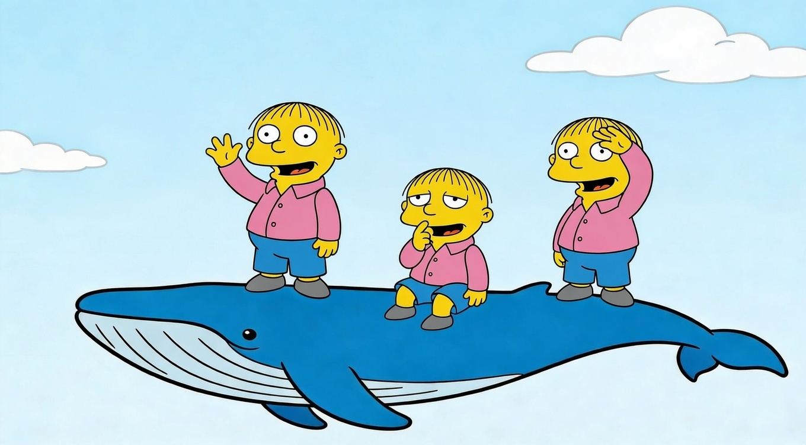

# ralph-in-a-box

Autonomous software engineering in a container, because YOLO. Give it a plan, walk away, come back to committed code.



ralph-in-a-box is a Docker-based implementation of the [Ralph technique](https://ghuntley.com/ralph/) by Geoffrey Huntley. It runs an AI coding agent in a bash loop — one task per iteration — with structured task tracking via [beads](https://beads.sh) (a CLI task tracker, invoked as `bd`), a three-phase pipeline (implement → test → review), automatic bootstrapping from a plain-text action plan, and a verification step that checks plan coverage before pushing.

Supports four agent backends: **Claude Code**, **Cursor Agent**, **OpenAI Codex**, and **Ollama** (local models).

## Architecture

```
ACTION_PLAN.md (you write this)
      │
      ▼
ralph-in-a-box.sh /path/to/project
      │
┌─────┴──────────────────────────────────────────┐
│  Docker container (isolated)                    │
│  ralph-loop.sh                                   │
│                                                 │
│  ┌───────────────────────────────────────────┐  │
│  │ Iteration 0: BOOTSTRAP                    │  │
│  │   Read ACTION_PLAN.md                     │  │
│  │   → bd init                               │  │
│  │   → Create Epics + [impl] tasks           │  │
│  ├───────────────────────────────────────────┤  │
│  │ Iteration 1: [impl] Feature A → [test]    │  │
│  │ Iteration 2: [test] Feature A → [review]  │  │
│  │ Iteration 3: [review] Feature A → commit  │  │
│  │ Iteration 4: [impl] Feature B → [test]    │  │
│  │ ...                                       │  │
│  ├───────────────────────────────────────────┤  │
│  │ Final: VERIFY plan coverage (report only) │  │
│  │        → git push → exit 0                │  │
│  └───────────────────────────────────────────┘  │
└────────────────────────────────────────────────┘
```

Each iteration, the agent picks the highest-priority ready task from beads, executes one phase, creates the next phase task, and exits to reset its context window. Task descriptions carry context between iterations, not conversation history.

| Phase     | Prefix     | On Success                    | On Failure                 |
| --------- | ---------- | ----------------------------- | -------------------------- |
| Bootstrap | —          | Create Epics + `[impl]` tasks | Exit with error            |
| Implement | `[impl]`   | Create `[test]` task          | Report blocker             |
| Test      | `[test]`   | Create `[review]` task        | Reopen `[impl]` with error |
| Review    | `[review]` | Commit + close Epic           | Reopen `[test]` with error |
| Verify    | —          | Print coverage report         | — (informational only)     |

Failures retry up to 3 times before creating a blocker task for manual intervention.

## Prerequisites

- **Docker** — containers are the only runtime dependency
- **Your project must be a git repository** — ralph-in-a-box commits and pushes code via git
- **An API key or authenticated agent** — see [Agent Backends](#agent-backends)

## Quick Start

### 1. Build the image

Each image includes all agent CLIs (Claude, Cursor, Codex). The agent is selected at runtime via `RALPH_AGENT`:

```bash
# Python
docker build -f python/Dockerfile.python -t ralph-python:latest .

# Rust
docker build -f rust/Dockerfile.rust -t ralph-rust:latest .
```

### 2. Create your plan

```bash
cat > /path/to/project/ACTION_PLAN.md << 'EOF'
## Feature 1: User Authentication

- Add login endpoint with JWT token generation
- Add auth middleware for protected routes

## Feature 2: User Profile

- Create profile page with edit capability
- Depends on: auth middleware from Feature 1
EOF
```

Each `##` group becomes an Epic, each bullet becomes an `[impl]` task. Cross-group dependencies are supported.

### 3. Run

```bash
RALPH_AGENT=<agent> <API_KEY_VAR>=<key> ./ralph-in-a-box.sh /path/to/project
```

Examples:

```bash
# Claude (API key)
ANTHROPIC_API_KEY=sk-ant-... \
  ./ralph-in-a-box.sh /path/to/project

# Claude (Bedrock)
CLAUDE_CODE_USE_BEDROCK=1 \
  ./ralph-in-a-box.sh /path/to/project

# Cursor
RALPH_AGENT=cursor \
CURSOR_API_KEY=cur-... \
  ./ralph-in-a-box.sh /path/to/project

# Codex
RALPH_AGENT=codex \
OPENAI_API_KEY=sk-... \
  ./ralph-in-a-box.sh /path/to/project

# Ollama (local model — Ollama must be running on the host)
RALPH_AGENT=ollama \
RALPH_OLLAMA_MODEL=qwen2.5-coder:14b \
  ./ralph-in-a-box.sh /path/to/project

# Rust variant (any agent)
RALPH_IMAGE=ralph-rust:latest \
  ./ralph-in-a-box.sh /path/to/project rust/DO_TASK_RUST.md
```

### What to expect

A typical run with 2 features (4 deliverables) takes **8-12 iterations**. You'll see output like:

```
═══════════════════════════════════════════════════════════
ITERATION 1/50 | Cost: $0.00/$100.00 | Agent: claude
═══════════════════════════════════════════════════════════
Tasks: 2 ready, 4 total open
---
[TOOL] Bash: bd show abc123...
[TOOL] Write: src/validation.py...
[TOOL] Bash: bd close abc123...
---
[COST] This run: $0.27 | Total: $0.27
```

## Agent Backends

Selected via `RALPH_AGENT` (defaults to `claude`). All three use the same loop, prompts, beads tasks, and git workflow.

| Agent | `RALPH_AGENT` | Auth env var | Config dir |
| --- | --- | --- | --- |
| **Claude Code** | `claude` | `ANTHROPIC_API_KEY`, or `CLAUDE_CODE_USE_BEDROCK=1`, or subscription (`claude login`) | `~/.claude` |
| **Cursor Agent** | `cursor` | `CURSOR_API_KEY` | `~/.cursor` |
| **OpenAI Codex** | `codex` | `OPENAI_API_KEY` | `~/.codex` |
| **Ollama** | `ollama` | _(none — runs locally)_ | `~/.claude` |

The agent's host config directory is copied (not mounted) into the container at startup, so your host configuration is never modified.

## Configuration

All settings are environment variables:

| Variable                     | Default             | Description                                               |
| ---------------------------- | ------------------- | --------------------------------------------------------- |
| `RALPH_AGENT`                | `claude`            | Agent backend: `claude`, `cursor`, `codex`, or `ollama`   |
| `RALPH_IMAGE`                | `ralph-python:latest` | Docker image to use                                     |
| `MAX_ITERATIONS`             | `50`                | Maximum loop iterations before stopping                   |
| `MAX_COST`                   | `100.00`            | Maximum spend in USD (Claude only)                        |
| `ANTHROPIC_API_KEY`          | —                   | Claude auth (API key)                                     |
| `CLAUDE_CODE_USE_BEDROCK`    | —                   | Set to `1` for AWS Bedrock (mounts `~/.aws` read-only)    |
| `CURSOR_API_KEY`             | —                   | Cursor auth                                               |
| `OPENAI_API_KEY`             | —                   | Codex auth                                                |
| `ANTHROPIC_MODEL`            | —                   | Override Claude model                                     |
| `ANTHROPIC_SMALL_FAST_MODEL` | —                   | Override Claude small/fast model                          |
| `AWS_PROFILE`                | —                   | AWS profile (Bedrock only)                                |
| `AWS_REGION`                 | —                   | AWS region (Bedrock only)                                 |
| `RALPH_OLLAMA_MODEL`         | `qwen2.5-coder:14b` | Model name passed to Ollama (`RALPH_AGENT=ollama` only)   |
| `RALPH_MIN_DOCKER_MEM_GB`   | `10`                | Minimum Docker memory (GB) — loop exits if below this     |
| `RALPH_REQUIRE_AWS`          | —                   | Set to `1` to require valid AWS credentials at startup    |


## Container Isolation

The Docker boundary is the security perimeter. The agent runs with permission-skipping flags inside the container — the container itself limits what it can reach.

| Mount                        | Path in Container                                    | Access     | Condition    |
| ---------------------------- | ---------------------------------------------------- | ---------- | ------------ |
| Project workspace            | `/workspace`                                         | read/write | Always       |
| Agent config dir (temp copy) | `/root/.claude`, `/root/.cursor`, or `/root/.codex`  | read/write | Always       |
| `~/.aws`                     | `/root/.aws`                                         | read-only  | Bedrock only |
| Prompt files                 | `/opt/ralph/*.md`                                    | read-only  | Always       |
| `ralph-loop.sh`              | `/opt/ralph/ralph-loop.sh`                           | read-only  | Always       |

## Live Monitoring

When running inside tmux, `ralph-in-a-box.sh` creates a split pane that tails the JSON log stream. Without tmux, monitor manually:

```bash
# Log file is named <agent>_live_<project>.log
tail -f /tmp/ralph_logs/claude_live_myproject.log | jq -R 'fromjson? // .'
```

## Exit Codes

| Code  | Meaning                                |
| ----- | -------------------------------------- |
| `0`   | All tasks completed, changes pushed    |
| `1`   | No tasks and no ACTION_PLAN.md found   |
| `2`   | Blocked — manual intervention required |
| `3`   | MAX_ITERATIONS reached                 |
| `4`   | MAX_COST exceeded (Claude only)        |
| `6`   | Environment error (AWS token expired, Docker OOM/unreachable) |
| other | Agent error                            |

## Agent Settings

Agent configuration lives in `agent-settings/` inside this repo — versionable, shared across machines, and separate from your personal dotfiles.

```
agent-settings/
  claude/
    CLAUDE.md          # Ralph-specific instructions injected into every iteration
    specs -> ~/.claude/specs   # Symlink resolved at runtime by cp -rL
  cursor/
    rules/
      ralph-loop.mdc   # alwaysApply: true — merged on top of ~/.cursor/rules at runtime
```

At launch, `ralph-in-a-box.sh` builds a writable tmpdir for the container:

- **Claude / Ollama:** copies `agent-settings/claude/` (symlinks resolved) then overlays OAuth credentials from `~/.claude/.credentials.json` if present
- **Cursor:** copies `~/.cursor/` first, then overlays `agent-settings/cursor/` on top — repo rules win on conflict

**Auth credentials are never stored here.** They come from environment variables or, for Claude subscription (OAuth), from `~/.claude/.credentials.json` which is copied separately at runtime and never committed.

To add or override rules, edit files under `agent-settings/`. Changes take effect on the next run — no image rebuild needed.

## Project Conventions

All prompts instruct the agent to read `AGENTS.md` from the project root before starting work. Use this file to set coding standards, approved libraries, and architectural rules that apply to every iteration — regardless of which agent backend is running.

```
myproject/
  AGENTS.md         # "Read all files in specs/"
  specs/
    testing.md → ~/coding-specs/testing.md
    auth.md    → ~/coding-specs/auth.md
  ACTION_PLAN.md
```

## Manual Task Creation

To skip bootstrap and create tasks directly (requires [beads](https://beads.sh) on the host):

```bash
cd /path/to/your/project
bd init --stealth
bd create "Epic: your feature" --type epic --priority 0
bd create "[impl] implement your feature" \
  --parent <epic-id> \
  --type task \
  --priority 0 \
  --description "What needs to be done. RETRY: 0"
```

To re-bootstrap from scratch, remove `.beads` and run again.

## Test Projects

`test_projects/` contains minimal workspaces for pipeline validation:

| Directory      | Language | What it tests                         |
| -------------- | -------- | ------------------------------------- |
| `test_python/` | Python   | Stats utilities — pytest + ruff       |
| `test_rust/`   | Rust     | Math utilities — cargo test + clippy  |
| `test_generic/`| Python   | Generic string utilities              |
| `test_direct/` | Python   | Direct task execution (pre-created)   |
| `test_agents/` | Python   | Multi-agent variant                   |


```bash
rm -rf test_projects/test_python/.beads
./ralph-in-a-box.sh test_projects/test_python
```

## Credits

Implementation of the Ralph technique by Geoffrey Huntley:

- [Ralph Wiggum as a "software engineer"](https://ghuntley.com/ralph/) — the original technique
- [Everything is a ralph loop](https://ghuntley.com/loop/) — the loop as the fundamental unit of software construction

> _"Ralph is monolithic. Ralph works autonomously in a single repository as a single process that performs one task per loop."_
> — Geoffrey Huntley

## Further Reading

- [Don't waste your backpressure](https://banay.me/dont-waste-your-backpressure/) — why constraining AI agents improves output quality
- [Introducing Beads: a coding agent memory system](https://steve-yegge.medium.com/introducing-beads-a-coding-agent-memory-system-637d7d92514a) — the design behind beads
